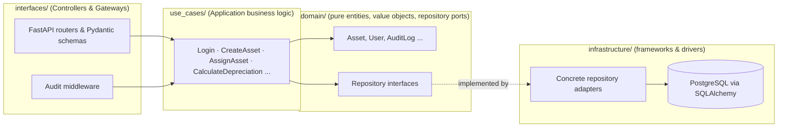
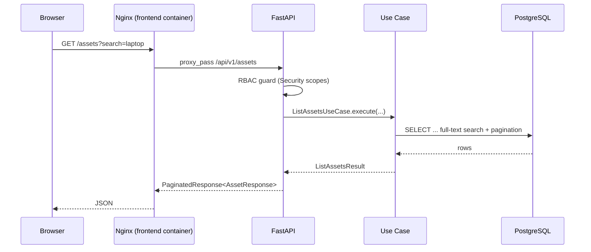

# Nexus — Enterprise Asset & Compliance Management System

A full-stack, portfolio-grade monorepo demonstrating Clean Architecture on the backend and
Feature-Sliced Design on the frontend.

**Stack:** FastAPI (async SQLAlchemy + Alembic) · PostgreSQL · React + TypeScript + Vite ·
Tailwind CSS + ShadcnUI · TanStack Query · Zustand · Recharts.

## Quick Start (Docker — recommended)

Requires Docker Desktop.

```bash
cp .env.example .env
docker compose up --build
```

This starts three services:

| Service  | URL                              | Notes                                  |
|----------|-----------------------------------|-----------------------------------------|
| frontend | http://localhost:3000            | Nginx serving the built React SPA       |
| backend  | http://localhost:8000/docs       | FastAPI + Swagger UI                    |
| db       | localhost:5432                   | PostgreSQL 16                           |

On first boot the backend automatically waits for Postgres, runs Alembic migrations, and
seeds demo data (roles, users, categories, sample assets with assignment history).

### Default credentials (from `backend/scripts/seed.py`)

| Role    | Email                 | Password       |
|---------|------------------------|----------------|
| Admin   | `admin@nexus.local`    | `ChangeMe123!` |
| Manager | `manager@nexus.local`  | `ChangeMe123!` |
| Viewer  | `viewer@nexus.local`   | `ChangeMe123!` |

To stop everything: `docker compose down` (add `-v` to also drop the Postgres volume).

## Local Development (without Docker)

Requires Python 3.12+, Node.js 20+, and a local PostgreSQL instance.

```bash
# Backend
cd backend
python -m venv .venv && .venv\Scripts\activate   # or `source .venv/bin/activate` on macOS/Linux
pip install -e ".[dev]"
alembic upgrade head
python scripts/seed.py
uvicorn app.main:app --reload   # http://localhost:8000

# Frontend (separate terminal)
cd frontend
npm install
npm run dev   # http://localhost:5173, proxies /api to http://localhost:8000
```

Or use the provided `Makefile` targets: `make dev-backend`, `make dev-frontend`, `make up`,
`make migrate`, `make seed`, `make test-backend`, `make test-frontend`.

## Architecture

### Backend — Clean Architecture layers



The dependency rule flows inward: `domain` has zero framework imports; `use_cases` depends
only on domain ports; `interfaces` depends on use cases; `infrastructure` implements the
domain ports and is wired at the edge via `infrastructure/di/container.py`. This is what lets
the (currently stubbed) real-time notification and reporting engines be added later as new
adapters without touching existing business logic.

### Request flow



### Frontend — Feature-Sliced Design

```
frontend/src/
├── app/            # providers, router
├── domain/         # shared TS types + Zod schemas mirroring backend DTOs
├── shared/         # ui primitives (shadcn), api client, hooks, layout
└── features/
    ├── auth/        # login form, JWT store (Zustand), auth API hooks
    ├── assets/      # data grid, filters, create/edit sheet, assign dialog
    ├── dashboard/   # Recharts distribution + summary cards
    ├── users/       # user lookups (used by the assign dialog)
    ├── notifications/  # NotificationBell — disabled stub
    └── reports/     # ExportButton — disabled stub
```

- **Server state** is owned by TanStack Query (`useAssets`, `useAsset`, etc.) — includes
  caching, background refetch, and `keepPreviousData` for smooth pagination.
- **Global UI/auth state** is owned by Zustand (`features/auth/store/auth.store.ts`), persisted
  to `localStorage` so a refresh doesn't log the user out.
- **`shared/lib/api-client.ts`** is an Axios instance with interceptors that attach the JWT to
  every request and redirect to `/login` on any `401` response.
- **`shared/hooks/usePermissions.ts`** exposes `canWrite` / `isAdmin` / `hasRole(...)` so UI
  elements (e.g. "New Asset", "Assign") can be conditionally rendered per the RBAC model
  (Admin, Manager, Viewer).

## Not implemented yet (intentionally stubbed)

Per the project scope, these are left as disabled UI stubs / empty backend interfaces so they
can be added later without refactoring the core:

- **Real-time notification engine** — `NotificationBell` is disabled with a "coming soon"
  tooltip; backend stub lives at `backend/app/domain/repositories/notification_port.py`.
- **Automated reporting/export engine** (Celery/Redis, PDF/Excel) — `ExportButton` is disabled
  with a "coming soon" tooltip.

## Testing

```bash
make test-frontend  # vitest + React Testing Library (LoginForm, AssetDataGrid)
```

Backend `pytest` unit tests for the use-case layer are a planned follow-up (`backend/tests/`
is scaffolded for this in the project layout but not yet populated).
